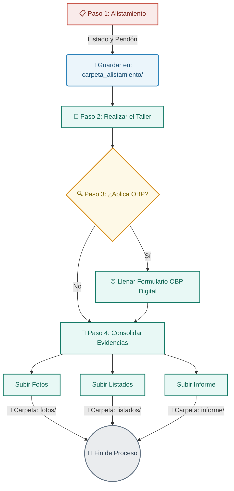

# 📝 Bitácora de Avance — MEAL CARE Colombia

Este archivo registra las actividades, avances, metodologías y evolución del sistema de Monitoreo, Evaluación, Rendición de Cuentas y Aprendizaje (MEAL) para el proyecto de Salud Sexual y Reproductiva y Entornos Protectores de **CARE Colombia**.

---

## 📖 Instrucciones de Uso para Agentes e Historial
> [!IMPORTANT]
> **Reglas para actualizar esta bitácora:**
> 1. **No borrar tareas completadas:** Cuando una tarea se termine, cámbiala de `[ ]` a `[x]` y añade la fecha de finalización. Mantener este historial es vital para evaluar el progreso real.
> 2. **Documentar errores y soluciones:** Si se encuentra un fallo en las bases de datos, APIs o Power BI, regístralo bajo la sección de "Errores y Soluciones" detallando la causa raíz y cómo se solucionó.
> 3. **Lecciones aprendidas:** Al final de cada hito, documenta qué funcionó, qué no y qué se puede optimizar en futuros reportes.
> 4. **Rol del Agente (Retroalimentación y Sugerencias):** El agente que lea este documento tiene la obligación de corregir al usuario amablemente si comete un error metodológico o técnico, y debe proponer sugerencias proactivamente cuando identifique oportunidades de mejora.
> 5. **Estado Temporal:** Esta estructura y reglas son iniciales e interinas ("mientras tanto"). Más adelante se incorporarán nuevas instrucciones a medida que se revisen formatos oficiales de CARE, documentos de referencia, manuales técnicos y archivos de datos reales.

---

## 🌟 Información del Proyecto
* **Organización:** CARE Colombia
* **Rol:** Oficial MEAL
* **Fecha de Inicio de Contrato:** 27 de Mayo de 2026
* **Enfoque Principal:** 
  * Prevención y atención en Salud Sexual y Reproductiva (SSR).
  * Creación y monitoreo de **6 Espacios Protectores** en 6 municipios clave.
  * Registro y control de atenciones: psicosociales, gestiones de caso, atenciones grupales, remisiones y entrega de kits.

---

## 📈 Tablero de Control de Actividades

- `[ ]` Mapeo y selección de los 6 municipios (Pendiente).
- `[ ]` Diseño de plantillas de recolección de datos en KoboToolbox (Pendiente).
- `[ ]` Configuración de la API REST para extracción automatizada (Pendiente).
- `[ ]` Diseño del modelo de datos e interfaz UI/UX en Power BI (Pendiente).
- `[ ]` Integración del repositorio con GitHub para control de cambios (Pendiente).
- `[x]` Crear flujos de procesos visuales para el equipo de campo (Completado: 2026-06-03).
- `[ ]` Crear diccionario de datos de las fuentes de información (Pendiente).

---

## 📌 Bitácora de Sesiones e Historial de Avance

### [2026-05-30] Sesión de Planificación Inicial
* `[x]` Estructuración inicial de las carpetas locales del workspace (`proyecto_CARE_MEAL`).
* `[x]` Definición de la arquitectura técnica simplificada (Kobo ➔ Power BI para datos, Jira solo para tareas críticas/PQR, libre de sobreingeniería).
* `[x]` Creación del documento técnico de [Arquitectura y Procesos](file:///C:/Users/Alfredo%20Pabón/Documents/Proyectos%20antigravity/proyecto_CARE_MEAL/docs/arquitectura_procesos.md).

### [2026-06-02] Definición del Contexto Global del Repositorio
* `[x]` Creación del archivo central [README.md](file:///C:/Users/Alfredo%20Pabón/Documents/Proyectos%20antigravity/proyecto_CARE_MEAL/README.md) en la raíz para unificar la Estrella del Norte, glosario, estructura de carpetas y políticas de confidencialidad de datos.

### [2026-06-03] Implementación del Visor Web MEAL Interactivo
* `[x]` Creación del visor interactivo premium [index.html](file:///C:/Users/Alfredo%20Pabón/Documents/Proyectos%20antigravity/proyecto_CARE_MEAL/docs/index.html) unificando la Teoría del Cambio y el Mapa Operativo.
* `[x]` Implementación del diseño "Humanitarian Clarity" extraído de Stitch (paleta CARE Orange `#E36F1E`, tipografía Inter, bordes sutiles y sombras de ambiente).
* `[x]` Programación de la lógica interactiva para alternar dinámicamente entre la Vista Geográfica (Cauca con 3 componentes y Norte de Santander con 2 componentes) y la Vista por Componente (Protección, Jurídico, Salud) en el Mapa Operativo.

### [2026-06-03] Optimización de UX y Depuración Técnica
* `[x]` Resolución de error de inicialización en consola unificando los scripts de JavaScript (eliminación de etiqueta `</script>` prematura que dejaba a `wizardState` inaccesible).
* `[x]` Vinculación de interacción fluida: Configuración de scroll automático y resaltado de tarjeta por 3 segundos al presionar indicadores en la Teoría del Cambio.
* `[x]` Corrección de ortografía municipal (cambio de "Harací" a "Hacarí").
* `[x]` Rediseño de botones de navegación del Asistente para que sean dinámicos indicando el paso previo específico ("Volver a departamento", "Volver a municipio", etc.).
* `[x]` Reemplazo de enlaces predeterminados rotos en carga de evidencias por badges ámbar personalizados de alta visibilidad: *"Próximamente links de evidencia"*.
* `[x]` Corrección de URL de recurso del logo de CARE para cargar desde `care_horizontal.webp`.

---

## ❌ Registro de Errores y Soluciones
*(Espacio para registrar fallos técnicos y sus resoluciones).*

---

## 🗺️ Diseño de Procesos y Flujogramas Operativos
*(Guías visuales para facilitar el trabajo de los colegas en territorio y estandarizar el guardado de evidencias).*

### Flujograma de Atención Psicosocial (Ejemplo de Proceso Estandarizado)
Este flujograma guía paso a paso a los profesionales en campo sobre cómo realizar un taller de atención psicosocial y dónde almacenar las evidencias requeridas por el área MEAL de forma autónoma.

* **Beneficio:** Estandarizar este flujo visual permite que el equipo de psicólogos y talleristas conozca de antemano qué soportes debe recolectar y exactamente en qué carpetas archivarlos, eliminando la necesidad de explicaciones repetitivas.

---

## 💡 Lecciones Aprendidas y Buenas Prácticas MEAL

### A. Diccionario de Datos y Pipelines (Estructura de Datos Limpia)
* **Buena Práctica:** Es fundamental construir y mantener un **Diccionario de Datos** (Metadata) para cada pipeline de información. Este diccionario debe definir cada columna de los Excel de origen (tipo de dato, si permite vacíos, descripción y formato). Esto asegura la consistencia cuando diferentes municipios reporten información y facilita la conexión a Power BI.

### B. Analítica Predictiva con Power BI
* **Buena Práctica:** Para responder a las necesidades de proyección e informes ejecutivos para CARE Colombia, se deben aprovechar las herramientas de **Pronóstico (Forecasting)** nativas de Power BI. Esto permite estimar tendencias futuras con bases estadísticas sólidas y un margen de error automático en gráficos de línea, evitando la sobreingeniería de programar modelos predictivos externos complejos en las fases iniciales.

---

## 📚 Repositorios y Herramientas a Tener en Cuenta
*(Lista de recursos guardados en GitHub para investigar y descargar en fases más avanzadas del proyecto).*

1. **[microsoft/markitdown](https://github.com/microsoft/markitdown)**: Utilidad de Microsoft para convertir cualquier documento de oficina (Word, Excel, PDF, audios) a Markdown, facilitando el procesamiento de manuales de donantes con Inteligencia Artificial.
2. **[adithya-s-k/omniparse](https://github.com/adithya-s-k/omniparse)**: Herramienta avanzada para ingestar y estructurar archivos y tablas procedentes de reportes complejos en territorio.
3. **[google/eng-practices](https://github.com/google/eng-practices)**: Guía oficial de prácticas de ingeniería de Google, clave para aprender estándares profesionales de documentación y control de cambios en código (DAX, M, o Python).
4. **[study8677/awesome-architecture](https://github.com/study8677/awesome-architecture)**: Repositorio con ejemplos y flujogramas de diseño de sistemas complejos, útil como inspiración para el mapeo de flujos de datos de CARE.
5. **Mermaid.js**: Motor de generación de diagramas en texto plano (Markdown) utilizado para crear los flujos visuales del proyecto directamente en la bitácora.

