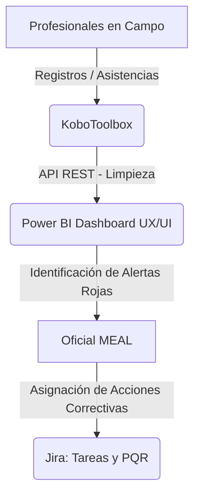

# 🤖 Arquitectura y Procesos MEAL — CARE Colombia

Este documento describe la arquitectura de datos, flujos de procesos y metodologías de gestión adoptadas para el proyecto de Salud Sexual y Reproductiva y Entornos Protectores, con un enfoque de **no sobreingeniería** y eficiencia operativa.

---

## ⚡ Filosofía de Diseño del Sistema
* "Herramientas sencillas para procesos complejos. Evitar matar moscas a cañonazos."
* **KoboToolbox & API Rest ➔ Power BI:** Es el motor principal para captura de datos, consolidación y monitoreo cuantitativo de metas del proyecto en los 6 municipios.
* **Jira:** Se utiliza de forma exclusiva para gestión de tareas de control, resolución de cuellos de botella e incidencias cualitativas, evitando sobrecargar a los profesionales de campo.

---

## 🛠️ Arquitectura de Herramientas y Roles

---

## 📂 Pilares de Uso de Jira en el Proyecto

### 1. Gestión de Compromisos e Indicadores (Kanban de Operaciones)
Jira **no** registra atenciones individuales. Registra las tareas críticas del proceso MEAL para que los datos lleguen a tiempo a los reportes.
* *Ejemplo:* `"Recibir y validar base de datos mensual de Villa del Rosario"` (Asignado al coordinador del punto).
* *Utilidad:* Prevenir retrasos en el indicador mensual de Power BI.

### 2. Gestión de PQRS (Rendición de Cuentas - Accountability)
La "A" de MEAL. Jira sirve como sistema de tiquetes para quejas y sugerencias de los beneficiarios.
* *Flujo de Trabajo:* `Buzón / Petición Recibida` ➔ `En Evaluación` ➔ `Asignado para Acción Correctiva` ➔ `Solucionado / Cerrado con Acta`.
* *Utilidad:* Mantener un historial auditable y medir tiempos de respuesta (SLA).

### 3. Tareas Internas del Oficial MEAL
Kanban personal de organización de flujos y entregables propios.
* *Flujo de Trabajo:* `Por Hacer` ➔ `En Proceso` ➔ `Bloqueado (En espera de terceros)` ➔ `Terminado`.
* *Utilidad:* Organización de prioridades y control de entregas.
