# 👥 Organigrama de CARE Colombia — Proyecto ConEsperanza

Este documento detalla la estructura organizativa, jerarquía y distribución territorial del equipo del proyecto.

---

## 🗺️ Distribución Territorial (Resumen por Sedes)

* **Bogotá (Sede Nacional / Administrativa):** Directora de País, Directora de Programas, Directora de Apoyo, Gerente de Gente y Cultura, Gerente de Alianzas, Contadora, Coordinadores Nacionales (Finanzas, Programas, MEAL, Cash) y oficiales administrativos.
* **Ocaña (Territorio Norte de Santander):** Coordinadora Territorial, Oficiales Psicosociales, Oficiales Legales, Gestoras Comunitarias, Oficial Logístico y Oficial MEAL.
* **Cauca (Territorio Suroccidente):** Coordinadora Territorial, Oficiales Psicosociales, Oficial Legal, Oficial de Salud, Gestoras Comunitarias, Oficial Logístico y Oficial MEAL.
* **Cúcuta (Norte de Santander):** Oficial de Localización, Oficial de Apoyo a Gestión de Casos, Gestora Comunitaria.
* **Tunja (Boyacá):** Oficial de Programa, Gestoras Comunitarias.
* **Santander de Quilichao (Cauca):** Oficial de Programa, Gestora Comunitaria.

---

## 📊 Estructura Jerárquica Completa

```
1. Directora de País (Bogotá)
├── 1.1. Directora de Unidad de Apoyo (Bogotá)
│   ├── 1.1.1. Oficial Junior de IT (Bogotá)
│   ├── 1.1.2. Coordinadora financiera y de compras (Bogotá)
│   │   ├── 1.1.2.1. Oficial de finanzas (Bogotá)
│   │   ├── 1.1.2.2. Oficial de compras (Bogotá)
│   │   ├── 1.1.2.3. Oficial de compras (Bogotá)
│   │   ├── 1.1.2.4. Oficial Logístico (Bogotá)
│   │   ├── 1.1.2.5. Oficial Logístico (Ocaña)
│   │   └── 1.1.2.6. Oficial Logístico (Cauca)
│   └── 1.1.3. Contadora (Bogotá)
│       └── 1.1.3.1. Oficial Contable (Bogotá)
├── 1.2. Gerente de Gente y Cultura (Bogotá)
│   ├── 1.2.1. Oficial de gente y cultura (Bogotá)
│   └── 1.2.2. Auxiliar de servicios Generales (Bogotá)
├── 1.3. Gerente de Alianzas y Sostenibilidad (Bogotá)
│   ├── 1.3.1. Oficial de comunicaciones (Bogotá)
│   ├── 1.3.2. Oficial Senior de incidencia (Bogotá)
│   └── 1.3.3. Oficial de localización (Cúcuta)
└── 1.4. Directora de Programas (Bogotá)
    ├── 1.4.1. Coordinadora de programas (Bogotá)
    │   ├── 1.4.1.1. Oficial de Programa (Tunja)
    │   │   ├── 1.4.1.1.1. Gestora Comunitaria (Tunja)
    │   │   └── 1.4.1.1.2. Gestora Comunitaria (Tunja)
    │   ├── 1.4.1.2. Oficial de programa (Santander de Quilichao)
    │   │   └── 1.4.1.2.1. Gestora Comunitaria (Santander de Quilichao)
    │   └── 1.4.1.3. Oficial de Apoyo a Gestión de Casos (Cúcuta)
    │       └── 1.4.1.3.1. Gestora comunitaria (Cúcuta)
    ├── 1.4.2. Coordinadora de Programa (Bogotá)
    │   ├── 1.4.2.1. Oficial de cumplimiento y Salvaguarda (Bogotá)
    │   ├── 1.4.2.2. Coordinadora territorial de programa (Ocaña)
    │   │   ├── 1.4.2.2.1. Oficial Psicosocial (Ocaña)
    │   │   ├── 1.4.2.2.2. Oficial Psicosocial (Ocaña)
    │   │   ├── 1.4.2.2.3. Oficial Psicosocial (Ocaña)
    │   │   ├── 1.4.2.2.4. Oficial legal (Ocaña)
    │   │   ├── 1.4.2.2.5. Oficial legal (Ocaña)
    │   │   ├── 1.4.2.2.6. Oficial legal (Ocaña)
    │   │   ├── 1.4.2.2.7. Gestoría comunitaria (Ocaña)
    │   │   ├── 1.4.2.2.8. Gestoría comunitaria (Ocaña)
    │   │   └── 1.4.2.2.9. Gestoría comunitaria (Ocaña)
    │   ├── 1.4.2.3. Coordinadora territorial de programa (Cauca)
    │   │   ├── 1.4.2.3.1. Oficial Psicosocial (Cauca)
    │   │   ├── 1.4.2.3.2. Oficial Psicosocial (Cauca)
    │   │   ├── 1.4.2.3.3. Oficial legal (Cauca)
    │   │   ├── 1.4.2.3.4. Oficial de Salud (Cauca)
    │   │   ├── 1.4.2.3.5. Gestoría comunitaria (Cauca)
    │   │   └── 1.4.2.3.6. Gestoría comunitaria (Cauca)
    │   └── 1.4.2.4. Coordinación CASH (Bogotá)
    │       └── 1.4.2.4.1. Oficial de CASH (Bogotá)
    └── 1.4.3. Coordinadora Nacional MEAL (Bogotá)
        ├── 1.4.3.1. Oficial MEAL (Ocaña)
        └── 1.4.3.2. Oficial MEAL (Cauca)
```

---

## 🎨 Diagrama del Equipo (Estructura de Reporte)

```mermaid
graph TD
    DP[1. Directora de País - Bogotá]
    
    UA[1.1. Directora de Unidad de Apoyo - Bogotá] --> IT[1.1.1. Oficial Junior IT - Bogotá]
    UA --> CFC[1.1.2. Coord. Financiera y Compras - Bogotá]
    CFC --> OF[1.1.2.1. Oficial Finanzas - Bogotá]
    CFC --> OC1[1.1.2.2. Oficial Compras - Bogotá]
    CFC --> OC2[1.1.2.3. Oficial Compras - Bogotá]
    CFC --> OL1[1.1.2.4. Oficial Logístico - Bogotá]
    CFC --> OL2[1.1.2.5. Oficial Logístico - Ocaña]
    CFC --> OL3[1.1.2.6. Oficial Logístico - Cauca]
    UA --> CO[1.1.3. Contadora - Bogotá]
    CO --> OC3[1.1.3.1. Oficial Contable - Bogotá]

    GC[1.2. Gerente Gente y Cultura - Bogotá] --> OGC[1.2.1. Oficial Gente y Cultura - Bogotá]
    GC --> ASG[1.2.2. Aux. Servicios Generales - Bogotá]

    AS[1.3. Gerente Alianzas y Sostenibilidad - Bogotá] --> OCM[1.3.1. Oficial Comunicaciones - Bogotá]
    AS --> OSI[1.3.2. Oficial Sr Incidencia - Bogotá]
    AS --> OL4[1.3.3. Oficial Localización - Cúcuta]

    PROG[1.4. Directora de Programas - Bogotá] --> CP1[1.4.1. Coordinadora de Programas - Bogotá]
    CP1 --> OPT[1.4.1.1. Oficial Programa - Tunja]
    OPT --> GCT1[1.4.1.1.1. Gestora Comunitaria - Tunja]
    OPT --> GCT2[1.4.1.1.2. Gestora Comunitaria - Tunja]
    
    CP1 --> OPS[1.4.1.2. Oficial Programa - Santander de Quilichao]
    OPS --> GCS1[1.4.1.2.1. Gestora Comunitaria - Santander de Quilichao]
    
    CP1 --> OGC_C[1.4.1.3. Oficial Apoyo Casos - Cúcuta]
    OGC_C --> GCC[1.4.1.3.1. Gestora Comunitaria - Cúcuta]

    PROG --> CP2[1.4.2. Coordinadora de Programa - Bogotá]
    CP2 --> OCS[1.4.2.1. Oficial Cumplimiento y Salvaguarda - Bogotá]
    CP2 --> CTO[1.4.2.2. Coord. Territorial - Ocaña]
    CTO --> OPS_O1[1.4.2.2.1. Oficial Psicosocial - Ocaña]
    CTO --> OPS_O2[1.4.2.2.2. Oficial Psicosocial - Ocaña]
    CTO --> OPS_O3[1.4.2.2.3. Oficial Psicosocial - Ocaña]
    CTO --> OL_O1[1.4.2.2.4. Oficial Legal - Ocaña]
    CTO --> OL_O2[1.4.2.2.5. Oficial Legal - Ocaña]
    CTO --> OL_O3[1.4.2.2.6. Oficial Legal - Ocaña]
    CTO --> GC_O1[1.4.2.2.7. Gestora Comunitaria - Ocaña]
    CTO --> GC_O2[1.4.2.2.8. Gestora Comunitaria - Ocaña]
    CTO --> GC_O3[1.4.2.2.9. Gestora Comunitaria - Ocaña]
    
    CP2 --> CTC[1.4.2.3. Coord. Territorial - Cauca]
    CTC --> OPS_C1[1.4.2.3.1. Oficial Psicosocial - Cauca]
    CTC --> OPS_C2[1.4.2.3.2. Oficial Psicosocial - Cauca]
    CTC --> OL_C1[1.4.2.3.3. Oficial Legal - Cauca]
    CTC --> OS_C1[1.4.2.3.4. Oficial Salud - Cauca]
    CTC --> GC_C1[1.4.2.3.5. Gestora Comunitaria - Cauca]
    CTC --> GC_C2[1.4.2.3.6. Gestora Comunitaria - Cauca]

    CP2 --> CC[1.4.2.4. Coordinación CASH - Bogotá]
    CC --> OC_B[1.4.2.4.1. Oficial CASH - Bogotá]

    PROG --> CNM[1.4.3. Coordinadora Nacional MEAL - Bogotá]
    CNM --> OM_O[1.4.3.1. Oficial MEAL - Ocaña]
    CNM --> OM_C[1.4.3.2. Oficial MEAL - Cauca]

    DP --> UA
    DP --> GC
    DP --> AS
    DP --> PROG
```


